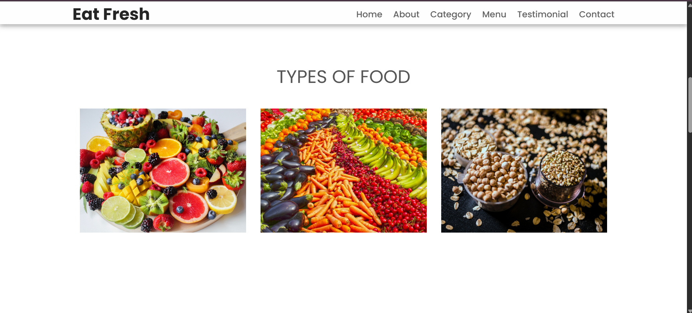
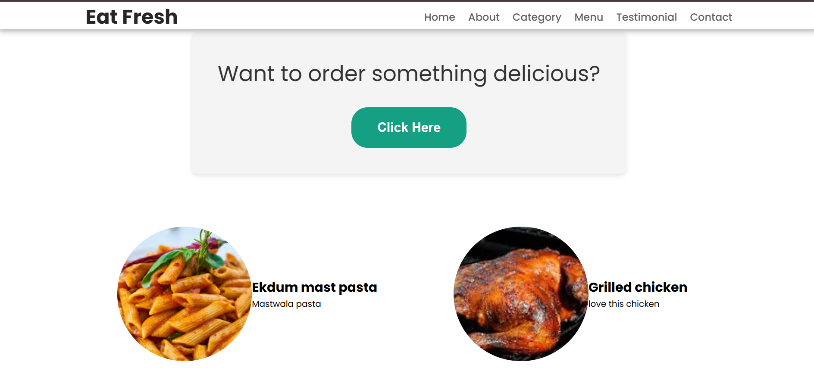
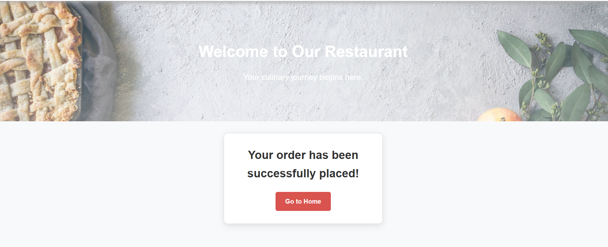

# Eat Fresh 🍽️

Eat Fresh is a dynamic and user-friendly **online food ordering website** where customers can explore delicious food categories, browse the menu, add items to a cart, and place orders directly through the site. It features user registration, login, order tracking, and more — all powered by a modern tech stack.

---

## 🚀 Features

- 🔐 User Registration and Login (stored in MongoDB)
- 📝 About Us and Contact Us Sections
- 🍱 Food Categories and Menu Page
- 🛒 Add to Cart and Checkout Flow
- 📦 Order Page with Real-Time Order Placement
- ⭐ Customer Reviews Section
- 💡 Clean and responsive UI using HTML, CSS, and JavaScript

---

## 🛠️ Tech Stack

- **Frontend**: HTML, CSS, JavaScript  
- **Backend**: Node.js  
- **Database**: MongoDB

---

## 📸 Screenshots

### 🏠 Home Page


### 🔐 Login Page


### 📂 Categories Page


### 📖 Menu Page


### 🛍️ Order Page


### 💳 Checkout Page


### 🌟 Customer Reviews


## 📦 Installation

To run the project locally:

```bash
git clone https://github.com/yourusername/eat-fresh.git
cd eat-fresh
npm install

